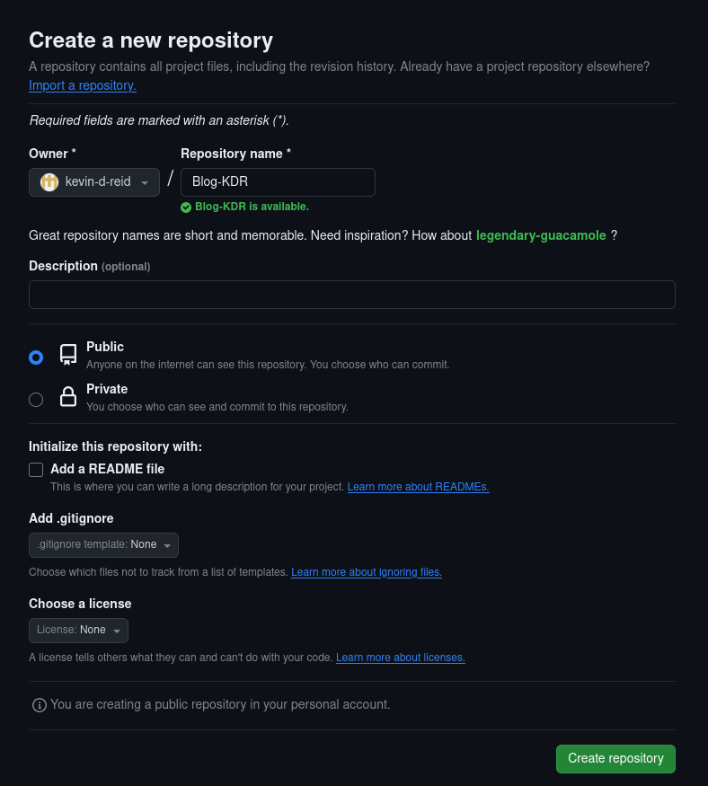
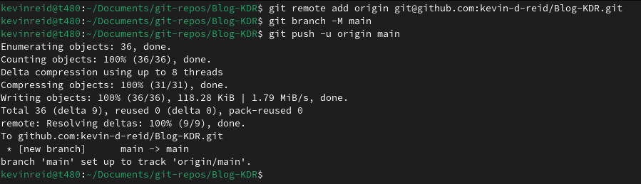
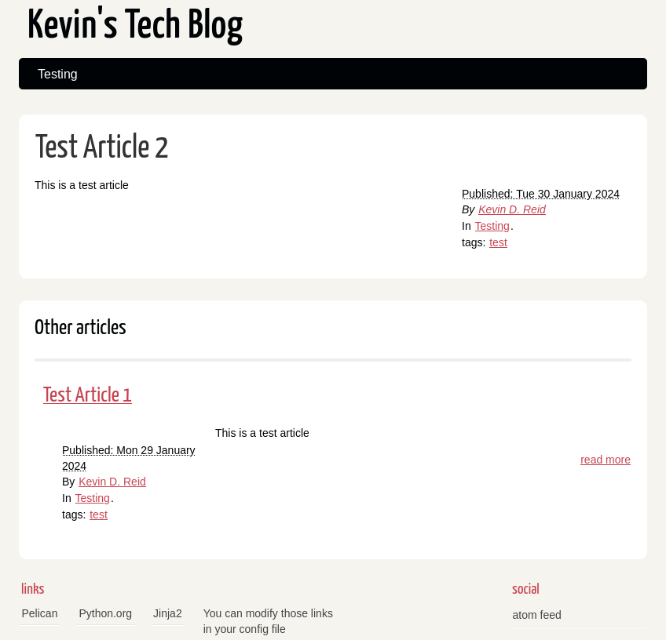
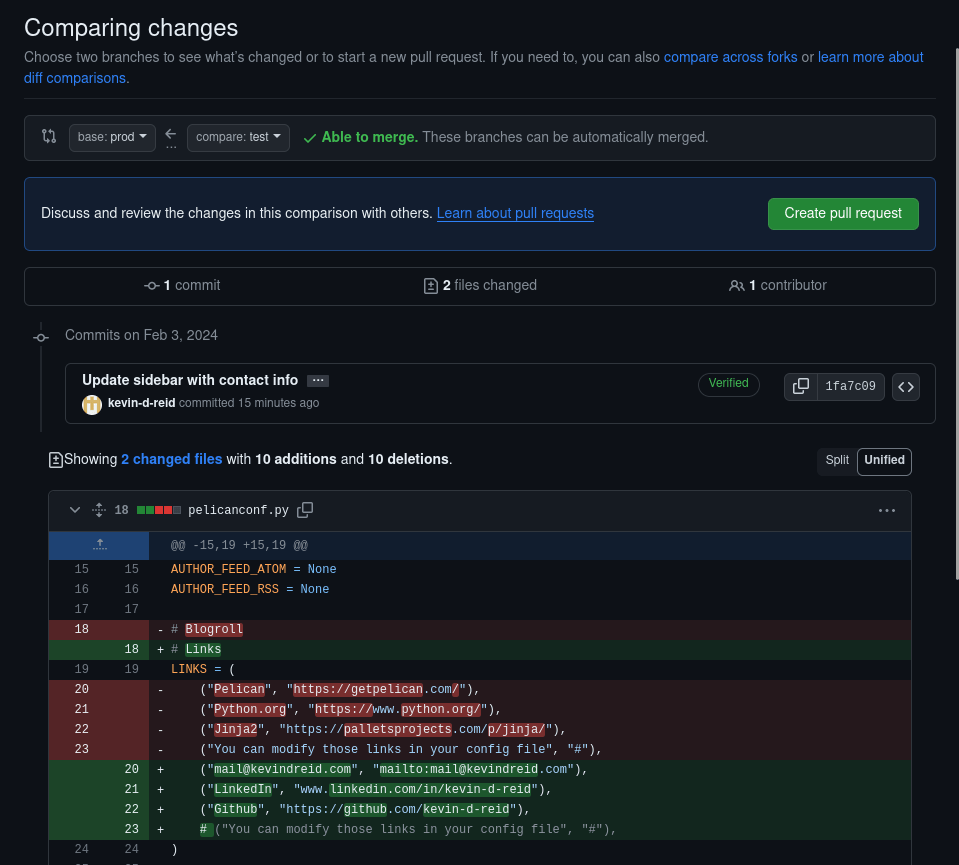

==================================================================
How to deploy a Pelican static website using Azure Static Web Apps
==================================================================

:date: 2024-02-03 15:40

:category: Cloud
:tags: static site, meta, git, azure, ci/cd
:author: Kevin D. Reid
:slug: azure-static-site
:url: azure-static-site
:status: published

Early into 2024, I decided I wanted to start a blog. I had a few topics I could go into and a couple article ideas ready to go, I just needed a place to post them. However, I didn't want to just post everything up on a dedicated blogging platform like Blogger_ or a coding-centric site like `Dev.to`_ as I knew I wanted a little more control and that the content may vary in the future. I also wanted to leverage the Cloud for the hosting side of things.

.. _Blogger: https://www.blogger.com/about/?bpli=1
.. _`Dev.to`: https://dev.to/

After a bit of research, I decided to use Pelican to generate a static site, Github to act as a remote repository, and Azure Static Web Apps as the host. This inaugural post will go through the setup process for a basic blog, with the end result being a clean and professional part of any web presence.

Static Site Generator
=====================

For creation of the blog, I opted for a static site generator. Static site generators take content written in a particular format and builds the HTML and CSS around it, which allows the author to focus on writing content while providing stylistic consistency across the website. When it comes to static site generators, there are popular options like Jekyll_ or Hugo_, which are written in Ruby and Go respectively. However, I wanted more exposure to Python, which led me to select Pelican_ as my generator of choice. Knowing the language a particular generator is built in isn't a hard requirement for using it, but I wanted that potential for additional exposure no matter how small.

.. _Jekyll: https://jekyllrb.com/
.. _Hugo: https://gohugo.io/
.. _Pelican: https://getpelican.com/

Setting up Pelican is fairly easy thanks to their documentation_. Python is required and a virtual environment is recommended, but only really needed if you have other Python projects present with different module version requirements. We'll stick with a simple direct install this time around, which can be done with the following command: ``python -m pip install pelican``

.. _documentation: https://docs.getpelican.com/en/latest/

To start using Pelican, we'll need some content to populate the generated site. Pelican uses reStructuredText_ documents to contain page contents by default, with Markdown offered as an alternative. I stuck with the default and built out a simple test article like so::

	==============
	Test Article 1
	==============

	:date: 2024-01-29 19:10
	:category: Testing
	:tags: test
	:status: published
	
	This is a test article

.. _reStructuredText: https://docutils.sourceforge.io/rst.html
	
The title is enclosed by the ``=`` sign on top and bottom, though only the bottom is required. A valid date in YYYY-MM-DD format is also the bare minimum, with the other fields and content itself being optional. Categories and Tags are useful for organization and search engine optimization (SEO), and the status can determine whether an article is visible or not. Pelican's documentation on content_ goes into more detail on what options are available. For setting up a basic site, Pelican supplies a ``pelican-quickstart`` command that walks you through the initial configuration like so:

.. _content: https://docs.getpelican.com/en/latest/content.html

The settings are pretty straightforward, with the only major changes from default being no URL prefix and no tasks.py/Makefile for automation. We can now move our test article to the content directory and run the command ``pelican content`` to generate our static site for the first time. This will take everything in the content directory and apply the default templates to it, with the result being complete HTML pages auto-generated in the output directory. To view the newly generated pages, Pelican has a preview environment accessible through the command ``pelican --listen`` which will present the generated content as if it was already hosted, the caveat being that it's only for the local computer. Navigating to the address ``http://127.0.0.1:8000`` will present our site with its default theme and test article, which looks like this:

Remote Repository and Version Control
=====================================

Having our Pelican sites running locally is nice, but what happens if my local computer breaks, or maybe I need to revert a configuration setting? All of this can be accomplished with Git and Github. Git_ is a version control system that enables the tracking of history within repositories, while Github_ is a remote site that hosts them. Github will also be used to deploy our site to the cloud host in the following section, but for now we'll setup the local Git repo and push it to Github.

.. _Git: https://git-scm.com/
.. _Github: https://github.com/

We'll start with initializing the local Git repo, which can be done by entering ``git init`` in the blog directory. This will create an empty repository, and entering ``git add <file>`` will add files to be tracked. However, before we do that we'll need to setup a Git ignore file to tell Git to not track the Pelican cache directory. Create a file in the directory called .gitignore, then enter the following::

	# Ignore Pelican cache directory
	__pycache__/

From here, we can enter ``git add .`` to track all files within the directory. Git will pickup on the .gitignore file and subsequently ignore the cache directory, which can be verified with ``git status`` giving the following output:

Entering ``git commit`` will commit the now-tracked files to the Git repository. I added a brief commit message with the ``-m`` switch to describe the changes, generally a good idea if you need to refer back to old changes.

With that, our new Pelican site is now recorded in the repository. This satisfies the need to view history and go back in time, but remote hosting of the repository will be done with Github_. This will require singing up for an account, then clicking the green ``New`` button on the main page or via Account → Your Repositories at the top right of the page.

Review the settings above, then select ``Create Repository`` at the bottom right to create the empty repository. Github provides some additional instructions here for cloning the repo to a computer or populating the repo with a local Git repository, which we will do with the Github-provided commands.

Cloud Hosting
=============

With our default site now backed up and its history tracked, we can turn our attention to hosting. A simple all-in-one option like `Github Pages`_ would be more streamlined, but I opted for `Azure Static Web Apps`_ instead. While both options generate sites from a Github repo, Azure Static Web Apps provide the ability to generate a preview environment through a pull request.

.. _`Azure Static Web Apps`: https://azure.microsoft.com/en-us/products/app-service/static
.. _`Github Pages`: https://pages.github.com/

Before deploying our blog web app, we'll need to select where it will be located in the organization structure. Azure uses a hierarchical method of organizing things; starting with Management Groups at the top, then Subscriptions, followed by Resource Groups and the Resources within them. This was the structure that I chose for my blog, which would isolate any potential charges that occur and integrate well with how my other Azure resources are organized::

	Tenant Root Group	(Management Group)
	|--- AzureLearning		(Management Group)
	|--- Homelab			(Management Group)
	\--- Websites			(Management Group)
	     |--- <other-website>		(Subscription)
	     \--- Blog-KDR			(Subscription)
		  \--- rg-Blog-KDR			(Resource Group)
		       \--- swa-Blog-KDR			(Resource)

Since setting up the static web app is a one-time thing, I used the Azure Portal to set things up manually. The Websites management group was already created, so I made a new subscription under it titled Blog-KDR, making sure to select the right management group under the Advanced tab. After that, go to the Static Web Apps page via the search bar at the top of the portal and select ``Create static web app``.

As shown in the image above, the static web app and its resource group are named according to the hierarchical diagram. We're using the Free plan and connecting it to my Github account, while the deployment region WestUS2 is only required for Azure Functions. The last section titled Build Details is where a workflow file is created for automation, which we'll customize soon. For now, we'll enter our info and select Review + Create at the bottom of the page, then Create to deploy the static web app.

Deployment should take a few minutes, and once it's ready our static site will be available by the randomly-generated link ending with ``azurestaticapps.net`` on the web app overview page. If you checked the Github repo while waiting, there's also a new commit made by Azure that adds a YAML file under the .github/workflows folder. This file uses `Github Actions`_ to automatically build and deploy the static site, a process known as Continuous Integration / Continuous Delivery or CI/CD which is a critical part of the DevOps methodology.

.. _`Github Actions`: https://github.com/features/actions

Remember how we deployed the Pelican site locally? We added content, told Pelican to regenerate with ``pelican content``, then started a local environment with ``pelican --listen``. Having to manually regenerate the content before pushing to the Github repo every time would get tiring quick, and the Pelican documentation uses different_ instructions for pushing to a production environment too. This would be a prime opportunity to automate that extra step, and we can do that with Github Actions.

.. _different: https://docs.getpelican.com/en/latest/publish.html#deployment

To start, we'll want to execute a ``git pull`` in our blog directory to pull down the YAML file. It's named after the default static web app name and located under ``.github/workflows``. We'll open the file and turn our attention to the following section::

	jobs:
	  build_and_deploy_job:
	    if: github.event_name == 'push' || (github.event_name == 'pull_request' && github.event.action != 'closed')
	    runs-on: ubuntu-latest
	    name: Build and Deploy Job
	    steps:
	      - uses: actions/checkout@v3
		with:
		  submodules: true
		  lfs: false
	      - name: Build And Deploy
		id: builddeploy
		uses: Azure/static-web-apps-deploy@v1
		with:
		  azure_static_web_apps_api_token: ${{ secrets.AZURE_STATIC_WEB_APPS_API_TOKEN_BLUE_COAST_0E9484F1E }}
		  repo_token: ${{ secrets.GITHUB_TOKEN }} # Used for Github integrations (i.e. PR comments)
		  action: "upload"
		  ###### Repository/Build Configurations - These values can be configured to match your app requirements. ######
		  # For more information regarding Static Web App workflow configurations, please visit: https://aka.ms/swaworkflowconfig
		  app_location: "/" # App source code path
		  api_location: "" # Api source code path - optional
		  output_location: "output" # Built app content directory - optional
		  ###### End of Repository/Build Configurations ######
	          
This portion of the YAML file handles the deployment from Github to Azure Static Web Apps. It's triggered by a push or an open pull request against the Github repo, and spins up an Ubuntu Linux instance to execute the actions under ``steps:``. The two steps currently listed are to checkout the Github repo and build/deploy to Azure Static Web Apps, and we'll add 3 additional steps in between leading to the following output::

	name: Build and Deploy Job
	  steps:
	    - name: Checkout
	      uses: actions/checkout@v4
	      with:
	        submodules: true
		lfs: false
	    - name: Set up Python
	      uses: actions/setup-python@v4
	      with:
		python-version: "3.11"
	    - name: Install Pelican
	      run: pip install pelican
	    - name: Build Pelican site
	      run: |
		pelican \
		  --settings "publishconf.py" \
		  --output "output/"
	    - name: Deploy
	      id: builddeploy
	      uses: Azure/static-web-apps-deploy@v1

Starting from the top; we checkout the repository, setup Python, install Pelican, build our Pelican site, then deploy it to Azure Static Web Apps. I made another test article, then committed that change to Git without regenerating the site locally. Upon pushing to Github, the workflow runs automatically and generates the site before deploying to Azure.

Finishing Touches
=================

Custom Domain
-------------

Our blog is almost ready for sharing with the world, but having to link people to the default ``azurestaticapps.net`` URL doesn't look very professional. Having a unique URL that is your own looks better, and that's where custom domains come into play. Unfortunately, you won't be able to purchase a domain name directly through Azure, so I went with Cloudflare_ as the registrar. Just setup an account with them and register a domain of your choosing, which will typically run you about $10. I opted for my name with a .com TLD, simple and professional.

.. _Cloudflare: https://www.cloudflare.com/

To start using this new domain, head back to the Static Web App and select Custom domains on the sidebar under Settings. Select Add, then Custom domain on other DNS. Enter your domain, then select Next to have Azure give you the records to enter into your registrar of choice. If you're using a root domain, you'll need to use the TXT record before adding the CNAME/ALIAS/A record that actually directs traffic.

With the records added and DNS propagated, our blog is now accessible via the root domain. Clicking the lock icon next to the address bar will show the free SSL certificate that Azure Static Web Apps provides. I also setup a second custom domain for the WWW prefix. The free plan supports 2 custom domains, so if you want additional domains or prefixes you'll have to upgrade to the Standard plan.

Staged Deployments
------------------

Our current pipeline for development is pretty simple at this point; we develop the site locally with ``pelican --listen`` to view changes, then push directly to the main branch on Github to deploy right away. However, adding a third stage in between will enable behaviour that more closely mimics professional software development. We'll do that by creating and switching to a new branch called ``test`` with the command ``git checkout -b test``, then setting the upstream branch with the command ``git push --set-upstream origin test`` so our local commits have somewhere to be pushed. 

NOTE: I also took the opportunity to change the ``main`` branch name to ``prod`` at this point to better reflect its role. This is done on the Github repo page via the View All Branches selection under the branches dropdown menu. Rename the branch through the menu on the right then go back to the main repo page. Github will notice the branch name was updated and will supply instructions to update the local repository too. Don't forget to update the workflow file as well!

On our ``test`` branch, we can now make changes normally and push them upstream without affecting the main production branch. Moving our changes from ``test`` to ``prod`` is done through a pull request on Github. With Azure Static Web Apps, initiating a pull request will spool up a temporary preview environment where you can view changes before they go live. On the Github repo page, select the Pull Requests tab then New Pull Request. We can select two branches to compare the differences between them, in this case ``prod`` as the base with ``test`` as the comparison.

With our pull request now created, the Github Actions workflow will trigger and start deployment to the preview environment. We can navigate to the Azure Static Web App page and view our production and preview environments on the Environments sidebar tab. Clicking the Browse link next to each environment will open it, which provides a good opportunity to load them side-by-side. If you're satisfied with the changes made, merging the pull request will deploy the updated site to the production environment and automatically tear down the test.

Before wrapping up this section, I'll make sure to resync the local and remote branches. Entering ``git pull`` will sync the ``prod`` branch, and I'll use ``git pull origin prod`` in the test branch to pull the latest commit from prod, then ``git push`` to finally sync the local and remote ``test`` branches. Our deployments are now closer to how the pros do it, with our workflow now looking like this::

	Local Development 
		-push-> Remote history storage 
			-pullReq-> Preview environment and testing 
				-mergePullReq-> Deploy to production

Changing the Theme
------------------

Pelican's default theme is nice and basic, but we can easily change it out for something a little more stylish. There are many available in this `Github repo`_, of which I liked the look of the Octopress_ inspired theme the most. It has a darker colour scheme and is responsive by default. I downloaded the latest code from the master branch and moved it to a new theme directory within the static site root, then updated pelicanconf.py with the following line::

	THEME = "theme/octopress"

.. _`Github repo`: https://github.com/getpelican/pelican-themes
.. _Octopress: https://github.com/MrSenko/pelican-octopress-theme/tree/master

With a quick push to our test branch on Github and pull request started, our site will automatically deploy to the preview environment with the new theme. After the testing is done and the pull request merged, we can go to our production site and see our new theme live.

Conclusion
==========

And that's how it's done! Our new blog is ready to share, complete with automatic page generation and deployment, along with a custom domain and stylish theme. We touched on a lot of areas like version control and cloud hosting, and even some more advanced topics like automation and CI/CD. There's other things that can be done beyond this, such as setting up branch protection on Github or tweaking the new theme to really make it your own. From here, it's up to you to write content that engages an audience, or maybe it's just for you, that's cool too.
