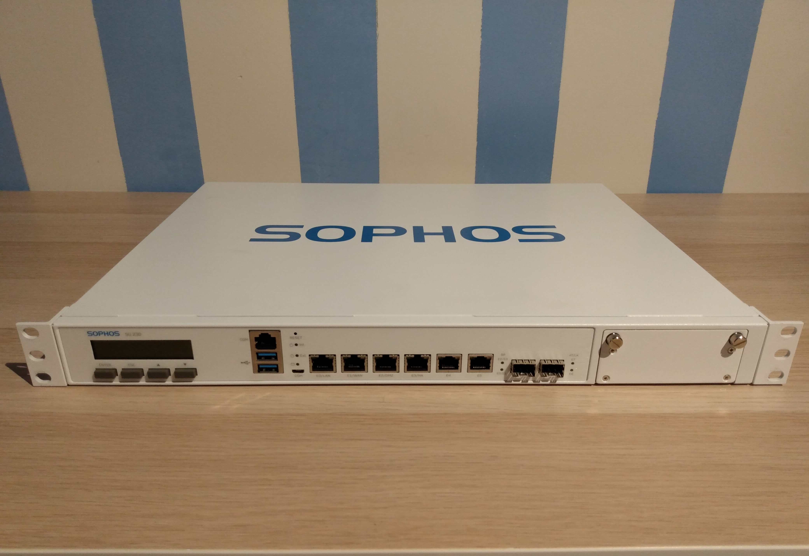
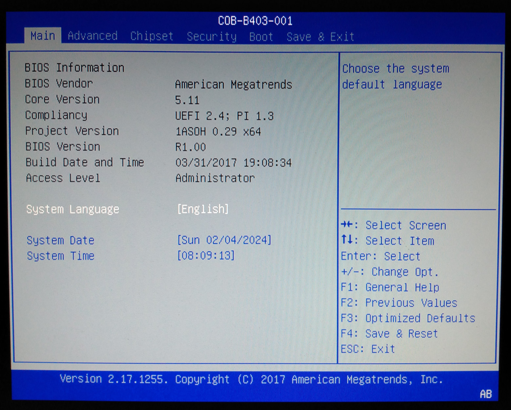
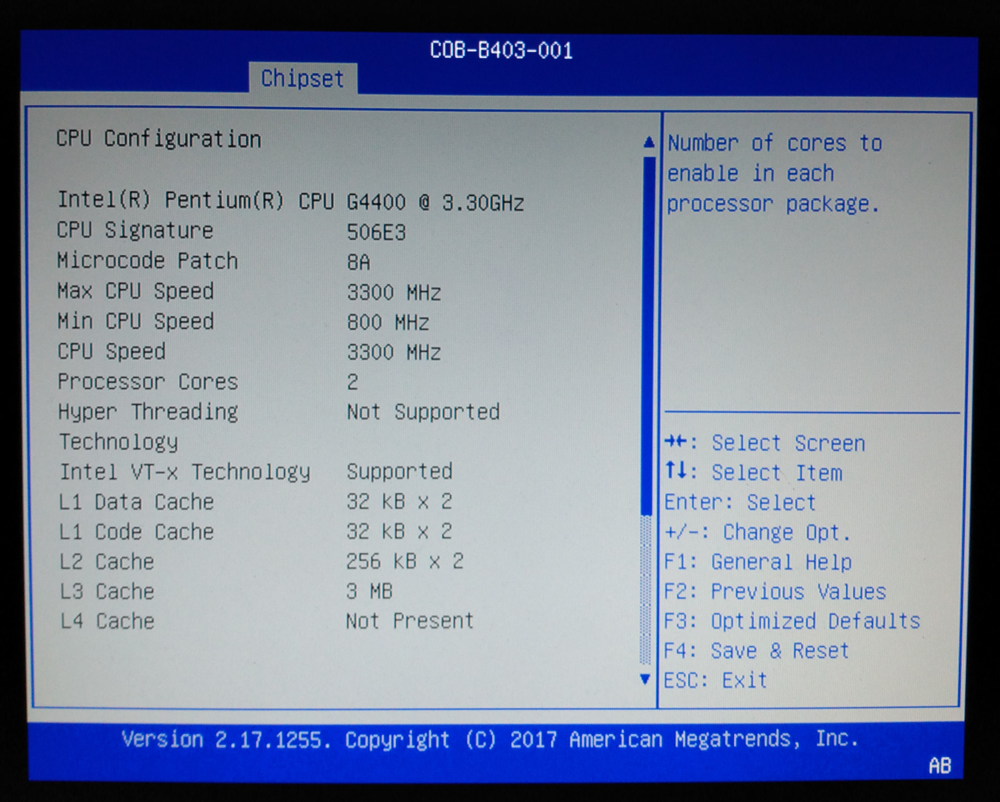
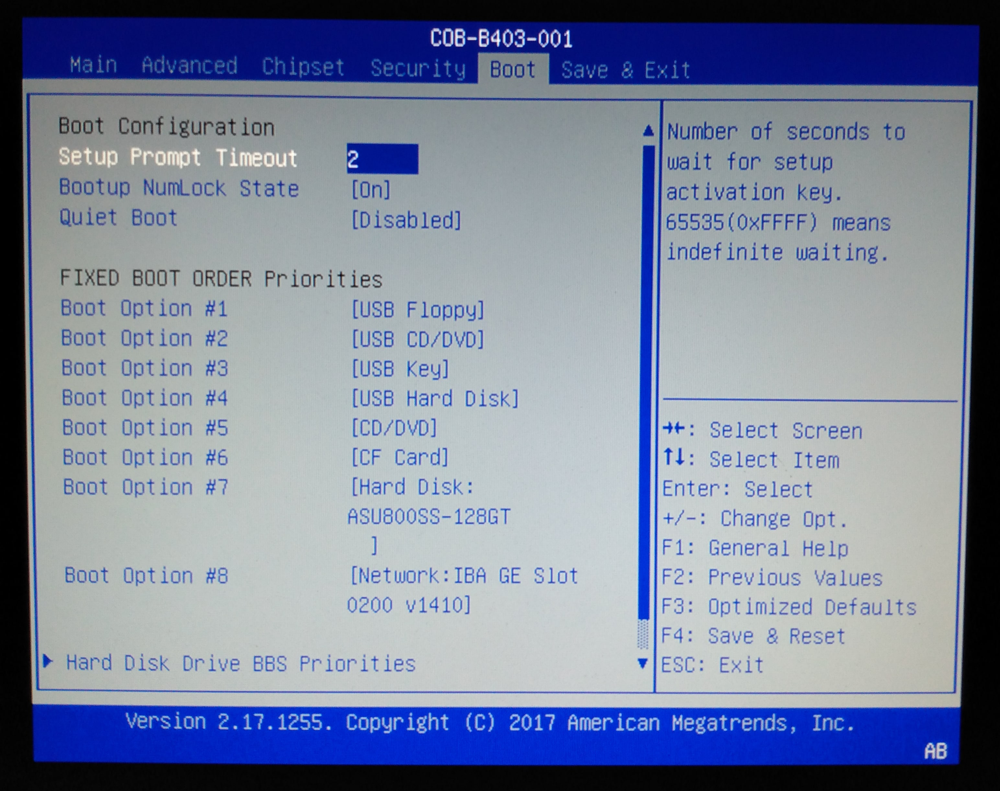
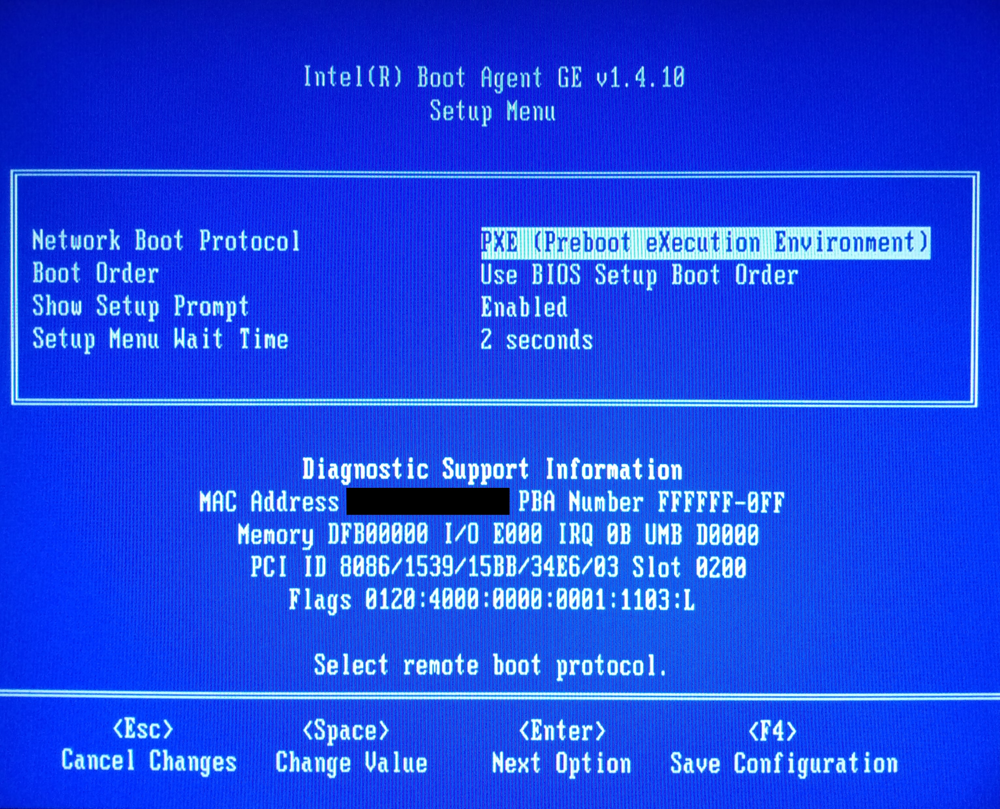
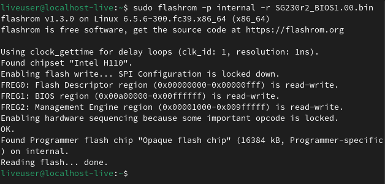
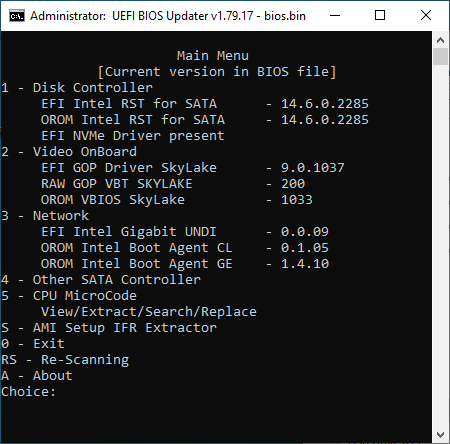
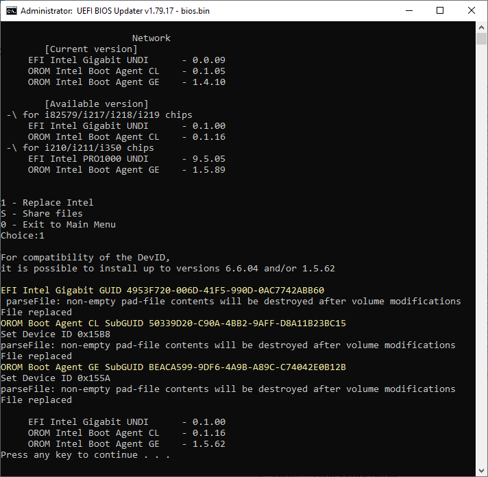
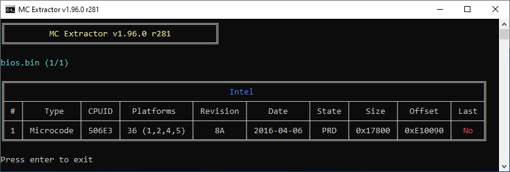
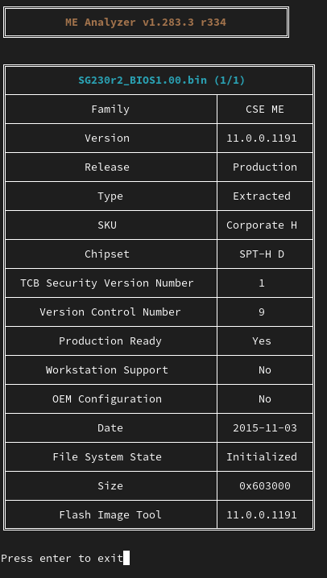

===============================================================================
Modding a network appliance firmware for greater security Part 1: Investigation
===============================================================================

:date: 2024-02-04 10:10

:category: Hardware
:tags: homelab, firewall, security
:author: Kevin D. Reid
:slug: sg230-firmware-part1
:url: sg230-firmware-part1
:status: published

When it comes to defense in depth, the perimeter is one of the first lines encountered. For many enterprises, that comes in the form of an NGFW or Next Generation Firewall, which is a device that builds upon the traditional firewall roles of packet filtering, NAT, and VPN support with intrusion prevention systems and deep packet inspection. I already knew I wanted one for my network and what operating system to run, but hardware selection was another issue. Virtualization of a firewall is growing in popularity for those looking to converge as much as they can on one box, but I favoured the more traditional route of a dedicated network appliance.

Enter the Sophos SG230 Rev 2.

This appliance from Sophos represents a lower mid-range offering from their rackmounted 1U options. Designed for medium-sized organizations and branch offices, the SG line runs the tried-and-true Sophos UTM software, while the equivalent XG line runs the newer Sophos Firewall OS (SFOS). Following a hardware refresh in 2017, this SG230 comes equipped with an Intel 6th gen dual core processor and 8GB of RAM, with 8x gigabit network ports comprised of 6x RJ45 alongside 2x SFP.

The unit I acquired (for $50 CAD, a bargain!) was manufactured in July of 2017, over 6 and a half years old when this was written. In the time since manufacturing, many Common Vulnerabilities and Exposures (CVE) have been discovered leaving the hardware vulnerable to various attacks. Unfortunately, Sophos only releases updated software (UTM or SFOS) for their devices, with no updated firmware for the device itself. The actual hardware is sourced from OEMs like Portwell and Caswell, and searches of their sites yielded no official firmware updates either.

That is why I took it upon myself to see what could be done to update the firmware. Using a mix of official and open source tools, I’ll go through various methods used to update the different parts that compose a firmware file, with the end goal of a more secure device that can be used for years ahead instead of being E-wasted prematurely. These methods can also be applied to other devices lacking updates or otherwise past their support periods too.

Initial investigation of the stock firmware
===========================================

Before we can start upgrading the firmware, we’ll have a look around in the setup to see what we’re dealing with. Entering the setup can be done by hitting <TAB> or <DEL> once the system is started. This leads us to a basic American Megatrends main page with info about the system, with the BIOS version R1.00 and Build Date of 2017/03/31 being important things to note.

Navigating to Advanced → CSM configuration shows the selection between Legacy and UEFI boot, with ``Legacy only`` being the default. While here, we’ll set the Network Option ROM execution to Legacy to show the Option ROM prompt on boot going forward.

Navigating to Chipset → CPU Configuration shows the first major security issue with our appliance. The line ``Microcode Patch`` has a value of 0x8A. Looking up the patch in this Level1Techs archive_ (under Socket 1151 → 506E3) shows this microcode patch with a build date of 2016/04/06. Since that time, critical CVEs like `Meltdown and Spectre`_ have been discovered and made major headlines as manufacturers scrambled to patch their CPUs and motherboards. Unfortunately, our device is still vulnerable to these CVEs and patching the BIOS with updated microcode to address that will be a top priority.

.. _archive: https://winraid.level1techs.com/t/offer-intel-cpu-microcode-archives/34261
.. _`Meltdown and Spectre`: https://www.techrepublic.com/article/spectre-and-meltdown-explained-a-comprehensive-guide-for-professionals/

Moving to the last tab, we’ll save and restart the system then re-enter the BIOS, navigating to the Boot tab. With the Network Option ROM execution enabled, we can now see the 1st network adapter as a boot option, note the version number v1410. Rebooting again and holding CTRL+S will enter the Option ROM Setup menu, which will give the full name and version number along with the PCI ID 8086/1539. 

Extraction of the stock firmware
================================

Now that we’ve learned all we can from the setup, let’s extract the firmware itself. We’ll start with booting a live Linux environment on the SG230. I used Fedora Linux, but any distro should work so long as it has a live environment available and the Flashrom utility included. Once it’s loaded, open a terminal window and execute the following command::

	sudo flashrom -p internal -r SG230r2_BIOS1.00.bin

Flashrom is a terminal utility that can read and write all sorts of EEPROM chips. The -p switch selects the partition (internal==firmware) and the -r switch reads the selected partition and writes the info to the file SG230r2_BIOS1.00.bin. Some systems will have locks present on the firmware preventing extraction or overwriting, but luckily this system has no such restrictions in place. Once Flashrom has finished reading the firmware, you’ll have to move the file to another system to start work on it. I recommend you make a copy of this file and keep it separate in case you lose or encounter an error with the file you’re currently working with.

Deep investigation of the stock firmware
========================================

With our newly extracted firmware file, we can now dive deep into it. Our first tool of choice will be UEFI BIOS Updater or UBU_, a tool I used during my overclocking days with an old AM3-based system. It’s capable of opening a firmware file and automatically updating certain modules and the microcode. For now, we’ll drop our firmware file into the main folder, rename it to bios.bin so UBU picks it up, and run UBU.bat.

.. _UBU: https://winraid.level1techs.com/t/tool-guide-news-uefi-bios-updater-ubu/30357

UBU has sub-menus for the different sections of the firmware it can access. Entering 1 at the main prompt will show us the SATA modules, while 2 will display the Video modules. Entering 3 takes us to the Network section, and entering 1 to replace the modules will reveal another issue.

As shown above, UBU has replaced the existing modules with the newer ones. However, the DevIDs for both OROMs don’t match the DevID 1539 that we saw on the OROM menu. Looking up the DevIDs_ listed_ reveals the OROMs installed are for I219-V and I218-LM network controllers, neither of which is present in the SG230. The EFI driver installed is also for I218/I219 chips, another incorrect module.

.. _DevIDs: https://devicehunt.com/view/type/pci/vendor/8086/device/15B8
.. _listed: https://devicehunt.com/view/type/pci/vendor/8086/device/155A

From here, we’ll switch programs to MCExtractor_. UBU technically has MCExtractor integrated already, but the version included isn’t up to date. Make sure that Python and the 3rd party modules ``colorama`` and ``pltable`` are installed, then launch the program from its folder via the command line::

	python.exe MCE.py bios.bin

.. _MCExtractor: https://github.com/platomav/MCExtractor

A single entry is present for CPUID 506E3 with revision 0x8A, matching what we saw in the setup menu. What’s interesting is the lack of support for 7th gen Kabylake CPUs. Since Sophos only sold these devices with Skylake chips and never refreshed them through their lifespan, I guess they never saw the need to include or test for them.

So far, what we’ve looked at is the BIOS region of the firmware file. There is also the ME region for Intel’s Management Engine, a separate embedded microcontroller that provides additional features and services for the system. We can explore the ME region using another Platomav tool, MEAnalyzer_. Like MCExtractor above, make sure the  prerequisite python module ``crccheck`` is installed, then launch it from the folder like so::

	python.exe MEA.py bios.bin

.. _MEAnalyzer: https://github.com/platomav/MEAnalyzer

There’s a lot of information in this output that we’ll dive into when we start to upgrade the Management Engine. For now, the important sections are Version, Chipset, and Date. The ME Region has version 11.0.0.1191 with a build date of 2015/11/03, over 8 years ago as of this writing. Since then, major CVEs have also targeted the Management Engine, notable among them is the collection in Intel SA-00086_ which details multiple buffer overflows and privilege escalations. Another interesting point is in the Chipset section, which only lists Skylake as supported. Kabylake launched on August 30th 2016, which means this ME version predated its existence on the market.

.. _SA-00086: https://www.intel.com/content/www/us/en/security-center/advisory/intel-sa-00086.html

Investigation summary
=====================

As detailed in the sections above, there’s a lot of work ahead to bring this network appliance up to par security-wise. At a minimum, the CPU microcode and Intel ME region must be updated to patch critical CVEs. We'll need to switch out the network modules for ones with correct device IDs, along with updating any other modules present. Finally, we'll look into hardware upgrades and potentially adding 7th gen Kabylake support too. It's a lot of ground to cover, so this will wrap up part 1 in the series. Thanks for reading!
